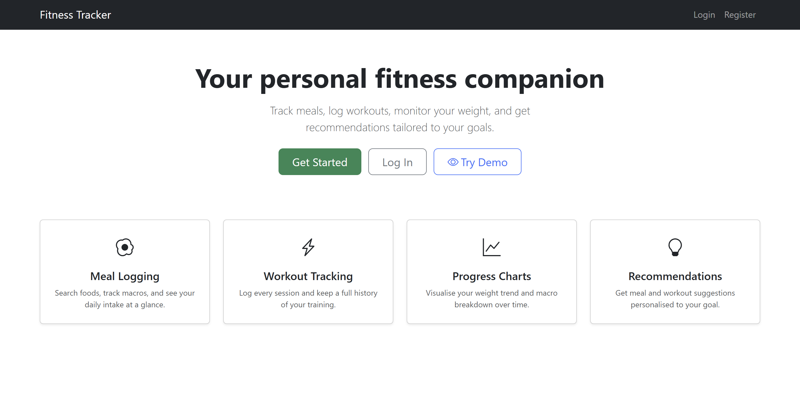

# Smart Fitness Tracker

A full-stack fitness tracking web app built with Flask and SQLAlchemy. Track meals and macros, log workouts, monitor your weight, and get recommendations tailored to your fitness goal.

**Live demo:** https://smart-fitness-tracker-production-8d95.up.railway.app/



## Features

- **Two-step registration** with fitness profile setup (goal, activity level, biological sex) for accurate calorie targets
- **Daily nutrition summary** on the dashboard — calories, protein, carbs, and fat tracked against your personalised TDEE target
- **Meal logging** with meal type grouping (Breakfast / Lunch / Dinner / Snack), USDA FoodData search, and macro auto-fill
- **Workout logging** with type, duration, and calories burned
- **Weight tracking** with a 7-day rolling average trend line
- **Progress analytics** — daily calorie history chart vs. TDEE target, 7-day macro breakdown, and weight trend
- **Personalised TDEE** using Mifflin-St Jeor with activity level multipliers and goal-based calorie targets (deficit for cutting, surplus for muscle gain)
- **Recommendations** — meal and workout suggestions informed by weight trend, macro intake, and fitness goal
- **Secure auth** — Flask-Login, Flask-WTF CSRF protection, scrypt password hashing

## Tech Stack

- **Backend:** Flask, Flask-SQLAlchemy, Flask-Login, Flask-WTF
- **Database:** SQLite (local), PostgreSQL (production via Railway)
- **Frontend:** Jinja2 templates, Bootstrap 5, Chart.js
- **APIs:** USDA FoodData Central

## Local Development

### 1. Clone the repository

```bash
git clone https://github.com/merleezy/smart-fitness-tracker
cd smart-fitness-tracker
```

### 2. Create and activate a virtual environment

```bash
python -m venv venv
venv\Scripts\activate        # Windows
source venv/bin/activate     # macOS / Linux
```

### 3. Install dependencies

```bash
pip install -r requirements.txt
```

### 4. Set up environment variables

Copy the example file and fill in your values:

```bash
cp .env.example .env
```

| Variable | Description |
|---|---|
| `SECRET_KEY` | A long random string — generate with `python -c "import secrets; print(secrets.token_hex(32))"` |
| `USDA_API_KEY` | Free API key from [FoodData Central](https://fdc.nal.usda.gov/api-guide.html) |
| `DATABASE_URL` | Leave as `sqlite:///app.db` for local development |
| `FLASK_ENV` | Set to `development` locally |

### 5. Run the app

```bash
python run.py
```

The database is created automatically on first run. Visit **http://127.0.0.1:5000**.
